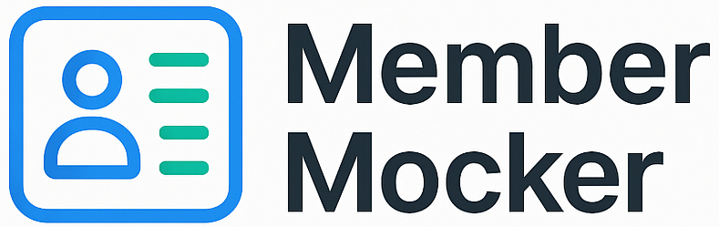

<p align="center">
    
</p>

Generate realistic mock membership data for testing and development purposes, with zero exposure of personally identifiable information (PII).

## Overview

MemberMocker is a powerful tool designed for developers and organizations who need to test applications with realistic membership data without compromising real user information. It generates synthetic data that mirrors the structure and characteristics of actual membership records while maintaining complete privacy and GDPR compliance.

### Key Features

- 🔒 Zero PII exposure - all identifiable information is synthetically generated
- 🎯 Real addresses with geocoordinates
- 🇩🇰 Tested in depth for Danish use cases
- 🌎 Can create membership data for most of the world
- 🚀 Easy-to-use API and web interface

## Quick Start

See [OLLAMA.md](OLLAMA.md) for detailed instructions on setting up the Ollama connection, which is required for member data generation.

## Technologies Used

### Frontend
- **React 19**: Modern JavaScript library for building user interfaces
- **Vite**: Next-generation frontend tooling and build system
- **Tailwind CSS**: Utility-first CSS framework for rapid UI development
- **Axios**: Promise-based HTTP client for API requests

### Backend
- **FastAPI**: Modern, fast web framework for building APIs with Python
- **DuckDB**: Embedded analytical database system
- **Pandas**: Data manipulation and analysis library
- **Pydantic**: Data validation using Python type annotations
- **Uvicorn**: Lightning-fast ASGI server implementation
- **Ollama**: AI model integration for data generation

## Getting Started

### Prerequisites

#### Docker Deployment (Recommended)
- Docker and Docker Compose
- Ollama with llama3.1

#### Local Development
- Python 3.12 or higher
- Node.js 18 or higher
- npm or yarn
- Git
- UV package installer (`pip install uv`)
- Ollama with llama3.1

### Installation

#### Using Docker (Recommended)

1. Clone the repository:
```bash
git clone https://github.com/yourusername/membermocker.git
cd membermocker
```

2. Copy the environment file:
```bash
cp .env.example .env
```

3. Start the application:
```bash
# For production
docker compose up --build

# For development
docker compose -f docker-compose.dev.yml up --build
```

The application will be available at:
- Production mode:
  - Frontend: http://localhost:80
  - Backend API: http://localhost:8000
  - API Documentation: http://localhost:8000/docs

- Development mode:
  - Frontend: http://localhost:5173
  - Backend API: http://localhost:8000
  - API Documentation: http://localhost:8000/docs

#### Local Installation

1. Clone the repository:
```bash
git clone https://github.com/yourusername/membermocker.git
cd membermocker
```

2. Set up the backend:
```bash
cd backend
uv sync
```

3. Set up the frontend:
```bash
cd frontend
npm install
```

### Running the Application

#### Using Docker (Recommended)

1. Ensure Ollama is running:
```bash
ollama serve
```

2. Start the application:
```bash
# Production mode
docker compose up

# Development mode (with hot-reload)
docker compose -f docker-compose.dev.yml up
```

#### Local Development

1. Start ollama:
```bash
ollama serve
```

2. Start the backend server:
```bash
cd backend
uvicorn app.main:app --reload
```

3. Start the frontend development server:
```bash
cd frontend
npm run dev
```

The application will be available at the URLs listed in the installation section.

## Usage

### Web Interface

1. Navigate to http://localhost:5173
2. Use the form to configure your data generation parameters
3. Generate and download your mock data set

### API Endpoints

- `POST /api/generate`: Generate a new mock dataset
- `GET /api/templates`: List available data templates
- `GET /api/statistics`: Get statistics about generated datasets

For detailed API documentation, visit the Swagger UI at http://localhost:8000/docs

## Project Structure

```
membermocker/
├── LICENSE
├── prd.md              # Project Requirements Document
├── readme.md
├── OLLAMA.md          # Ollama setup instructions
├── docker-compose.yml # Production Docker Compose configuration
├── docker-compose.dev.yml # Development Docker Compose configuration
├── .env.example       # Example environment variables
├── backend/            # Python FastAPI backend
│   ├── Dockerfile     # Backend container configuration
│   ├── pyproject.toml  # Python project dependencies
│   ├── uv.lock         # UV package lock file
│   ├── app/
│   │   ├── main.py    # Application entry point
│   │   ├── api/       # API routes and endpoints
│   │   ├── core/      # Core configurations
│   │   ├── models/    # Data models and schemas
│   │   └── services/  # Business logic
│   ├── data/          # Database storage
│   └── tests/         # Backend tests
└── frontend/          # React frontend
    ├── Dockerfile     # Frontend container configuration
    ├── index.html     # HTML entry point
    ├── vite.config.ts # Vite configuration
    ├── public/        # Static assets
    │   └── assets/    # Images and icons
    └── src/
        ├── components/  # Reusable UI components
        ├── pages/      # Page components
        ├── services/   # API integration
        └── types/      # TypeScript type definitions
```

## Contributing

1. Fork the repository
2. Create a feature branch (`git checkout -b feature/amazing-feature`)
3. Commit your changes (`git commit -m 'Add some amazing feature'`)
4. Push to the branch (`git push origin feature/amazing-feature`)
5. Open a Pull Request

## License

Copyright (c) 2025 Per Andersen. All rights reserved. See the LICENSE file for details.

## Acknowledgments

- Address data provided by [OpenStreetMap](https://www.openstreetmap.org/) © OpenStreetMap contributors